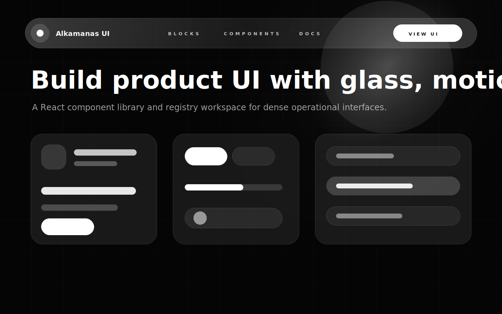

# Alkamanas UI

Alkamanas UI is a React component library, documentation app, and registry workspace for building dark, glass-forward product interfaces. It packages reusable primitives, motion patterns, theme tokens, shell components, and copy-and-customize registry metadata for the `@alkamanas` design system.

The project is designed for applications that need dense operational screens, expressive glass surfaces, smooth disclosure motion, section-aware navigation, and consistent form controls without rebuilding the same interaction details in every product.



## What Is Included

- `@alkamanas/ui`: React components, hooks, CSS tokens, surface styles, and motion behavior.
- `@alkamanas/cli`: Registry CLI scaffold for `alka` workflows.
- `@alkamanas/docs`: Vite documentation and preview app.
- `registry/`: Component metadata and hashes for copy-and-customize distribution.
- `.changeset/`: Versioning and release notes workflow.

## Core Ideas

- **Package-first primitives**: import stable components from `@alkamanas/ui`.
- **Registry-friendly customization**: use registry copies when a product needs to deeply modify a component.
- **Token-driven visuals**: color, radius, blur, shadows, and motion use CSS variables rather than hard-coded values.
- **Section-aware theming**: light and dark sections can coexist on one page through `.alka-theme-light` and `.alka-theme-dark` scopes.
- **Glass surfaces**: components can use the shared liquid glass system with `blurry` and opt-in `realistic` effects.
- **Smooth motion**: open, close, focus, blur, hover, and route transitions use shared easing tokens and respect `prefers-reduced-motion`.
- **ESM-first packaging**: the package ships modern ESM output and a single stylesheet export.

## Components

Alkamanas UI currently includes the following public component surface.

### Actions

- Button
- Button Group
- Toggle
- Toggle Group

### Forms

- Checkbox
- Combobox
- Input
- Input Group
- Input OTP
- Label
- Radio Group
- Select
- Slider
- Switch
- Textarea

### Overlays

- Alert Dialog
- Context Menu
- Dialog
- Drawer
- Dropdown Menu
- Popover
- Sheet
- Toast
- Tooltip

### Navigation

- Breadcrumb
- Menubar
- Navbar
- Sidebar
- Tabs

### Display

- Accordion
- Avatar
- Badge
- Card
- Carousel
- Collapsible
- Direction
- Flip Card
- Image Card
- Item
- Kbd
- Progress
- Scroll Area
- Separator
- Spinner

### Command And Shell

- Command
- Command Palette
- Floating Panel

## Install

```bash
pnpm add @alkamanas/ui
```

Install peer dependencies used by the components you render:

```bash
pnpm add react react-dom
pnpm add lucide-react react-hook-form
```

`lucide-react` and `react-hook-form` are peer dependencies marked optional. Add `lucide-react` when you use icon-forward components such as `Navbar`; add `react-hook-form` only when importing form integrations from `@alkamanas/ui/form`.

## Basic Usage

```tsx
import { Button, Card, CardContent, CardHeader, CardTitle } from "@alkamanas/ui";
import "@alkamanas/ui/styles.css";

export function WorkspaceCard() {
  return (
    <Card>
      <CardHeader>
        <CardTitle>Workspace</CardTitle>
      </CardHeader>
      <CardContent>
        <Button>Continue</Button>
      </CardContent>
    </Card>
  );
}
```

## Glass System

The default glass mode is the cost-efficient `blurry` surface. Components that support the shared glass layers can opt into the realistic displacement effect without changing the rest of the app:

```tsx
import { Navbar, NavbarCTA } from "@alkamanas/ui/navbar";
import "@alkamanas/ui/navbar.css";

export function ProductNavbar() {
  return (
    <Navbar
      theme="dark"
      glassEffect="realistic"
      glassRealisticStrategy="premium"
      logo={{
        wide: {
          dark: <span>Alkamanas UI</span>,
          light: <span>Alkamanas UI</span>,
        },
        compact: {
          dark: <span>A</span>,
          light: <span>A</span>,
        },
      }}
      logoWidths={{ wide: "10rem", compact: "2.25rem" }}
      links={[
        { href: "#blocks", label: "Blocks" },
        { href: "#components", label: "Components" },
      ]}
      rightSlot={<NavbarCTA href="#install">Install</NavbarCTA>}
      mobileFooterSlot={<NavbarCTA href="#install">Install</NavbarCTA>}
    />
  );
}
```

Available glass values:

- `glassEffect="blurry"`: standard backdrop blur surface.
- `glassEffect="realistic"`: displacement-backed glass layer.
- `glassRealisticStrategy="auto"`: chooses a cost-aware strategy based on surface size.
- `glassRealisticStrategy="static"`: uses the shared static lens treatment.
- `glassRealisticStrategy="premium"`: uses per-surface displacement for the strongest lens effect.

## Theming

Import the stylesheet once near the application root:

```tsx
import "@alkamanas/ui/styles.css";
```

Then scope sections with the namespaced theme classes or section theme attributes:

```tsx
<section className="alka-theme-dark">
  <Dashboard />
</section>

<section data-section-theme="light">
  <Settings />
</section>
```

`data-theme`, `data-section-theme` and `data-navbar-theme` all provide local light/dark tokens for contained components. If no section scope is present, components inherit the global app theme.

Primary color, semantic states, charts, border animation color, and surface gradient color are controlled with CSS variables. The system includes tokens for:

- `primary` and `primary-foreground`
- `destructive`
- `success`
- `warning`
- `info`
- `chart-1` through `chart-5`
- glass panel background, border, blur, and shadow values
- motion duration and easing values

## Navbar Theme Switching

`Navbar` can read sections marked with `data-navbar-theme`; the same attribute also themes components inside that section:

```tsx
<main>
  <section data-navbar-theme="dark" data-theme-color="#050505">
    <Hero />
  </section>
  <section data-navbar-theme="light" data-theme-color="#f5f5f7">
    <Content />
  </section>
</main>
```

The navbar follows the active section and can hide its panel while it is at the top of the page.

## Registry

The registry metadata lives in `registry/registry.json`. Update it after changing public components:

```bash
pnpm registry:update
```

Check for drift before publishing:

```bash
pnpm registry:check
```

The registry is meant for teams that want to copy component source into an application and customize it locally.

## Development

This repository uses pnpm workspaces.

```bash
corepack enable
pnpm install
pnpm dev
```

Useful commands:

```bash
pnpm lint
pnpm typecheck
pnpm test
pnpm build
pnpm verify
```

Run the docs app directly:

```bash
pnpm --filter @alkamanas/docs dev
```

Run the examples gallery:

```bash
pnpm dev:examples
```

`apps/examples` lists complete example pages as cards and opens each example as a full page built from `@alkamanas/ui` components. The first example is a basic landing page.

Run the npm consumer test app:

```bash
pnpm dev:npm-test
```

`apps/npm-test` is a Vite admin dashboard that installs `@alkamanas/ui` from npm instead of using the local workspace source alias. Use it after publishing to validate package resolution, styles, overlays, form controls, cards, navigation, and CLI-facing registry assumptions as a real consumer would.

Build only the UI package:

```bash
pnpm --filter @alkamanas/ui build
```

## Package Format

`@alkamanas/ui` is ESM-only. CommonJS `require()` is not supported. Projects using older Jest or Node setups need ESM-aware configuration or transpilation.

The package exposes a full JavaScript entrypoint and stylesheet:

```tsx
import { Button, Card, Sheet } from "@alkamanas/ui";
import "@alkamanas/ui/styles.css";
```

For lower-risk consumer integration, use focused subpaths when available:

```tsx
import { Navbar } from "@alkamanas/ui/navbar";
import "@alkamanas/ui/navbar.css";

import { Form, FormField } from "@alkamanas/ui/form";
```

## Publishing

Packages are scoped under the `@alkamanas` npm organization.

```bash
pnpm build
pnpm --filter @alkamanas/ui publish --access public
pnpm --filter @alkamanas/cli publish --access public
```

`@alkamanas/docs` is private and is not published to npm.

## Validation Checklist

Before pushing or publishing:

```bash
pnpm verify
```

For smaller local checks while iterating:

```bash
pnpm --filter @alkamanas/ui typecheck
pnpm --filter @alkamanas/docs typecheck
pnpm registry:check
```
